# Dokumentasi Teknis Sistem CMS HIMAGRO (Content Planner v2.0)
Dokumentasi ini disusun untuk pengurus Departemen Komunikasi dan Informasi (Kominfo) HIMAGRO berikutnya agar dapat mengelola, memelihara, dan mengembangkan sistem Content Management System (CMS) secara berkelanjutan.

---

## 1. Arsitektur & Alur Data Sistem

Sistem CMS HIMAGRO dibangun menggunakan Google Sheets sebagai basis data (*database*), Google Apps Script sebagai pengolah logika (*backend/API*), dan antarmuka web PWA (Progressive Web App) sebagai visualisasi (*frontend*).

### Diagram Alur Data Sistem

```mermaid
graph TD
    %% INPUT AREA
    subgraph INPUT: Form Responses
        F_Pres[Google Form Prestasi] -->|Entry Data Baru| SS_Pres_F[Spreadsheet Prestasi: Form Responses 1]
        F_MP[Google Form Media Partner] -->|Entry Data Baru| SS_MP_F[Spreadsheet Media Partner: Form Responses 1]
    end

    %% BACKEND PROCESSING AREA
    subgraph PROCESS: Google Apps Script API Code.gs
        %% Triggers
        Trigger_Monthly[Trigger Waktu Prestasi: Tanggal 1 & 15] -->|Jalankan| autoCreatePrestasiTask
        Trigger_Daily[Trigger Waktu Media Partner: Harian 01:00 Pagi] -->|Jalankan| autoCreateMediaPartnerTask
        
        %% Auto Create Functions
        autoCreatePrestasiTask -->|Ambil Data Baru| SS_Pres_F
        autoCreatePrestasiTask -->|Gabungkan & Panggil| createTaskData
        
        autoCreateMediaPartnerTask -->|Ambil Data H-7| SS_MP_F
        autoCreateMediaPartnerTask -->|Filter & Panggil| createTaskData
        
        %% Manual Automation API Action
        PWA_UI[PWA Frontend Dashboard] -->|Aksi: Auto Plan| processMediaPartnerRow
        processMediaPartnerRow -->|Ambil Baris Terpilih| SS_MP_F
        processMediaPartnerRow -->|Panggil| createTaskData
        
        %% Database Mutation
        createTaskData -->|Tulis Baris Baru & Pasang Formula Sisa Hari| SS_CP_Sheet[Spreadsheet Planner: Content Planner]
        
        %% Status Update
        createTaskData -->|Sukses: Set CMS_Status = PROCESSED| SS_Pres_F
        createTaskData -->|Sukses: Set CMS_Status = PROCESSED| SS_MP_F
    end

    %% DATABASE VISUALIZATION & OUTPUT
    subgraph OUTPUT: CMS & PWA Dashboard
        PWA_Load[Auto Sync: PWA Client] -->|Minta Action: getAllData| doGet
        doGet[doGet Entry Point] -->|Query Seluruh Data| CombinedData[getAllCombinedData]
        CombinedData -->|Ambil Tasks| SS_CP_Sheet
        CombinedData -->|Ambil Dropdowns| SS_CP_Drop[Spreadsheet Planner: Dropdown List]
        CombinedData -->|Ambil Log History| SS_CP_Log[Spreadsheet Planner: Log History]
        CombinedData -->|Kirim JSON/JSONP| PWA_Load
        
        PWA_Load -->|Evaluasi Sisa Hari <= 3 & Status != Done| UrgentBadge[Tampilkan Badge ⚠ URGENT & Border Merah]
        PWA_Load -->|Update Statistik Dashboard| StatsWidget[Widget Angka: Total, Done, In Progress, Urgent]
    end
```

### Penjelasan Alur:
1. **Pendaftaran (Form)**: Pengguna luar/mahasiswa mengisi formulir pendaftaran prestasi atau kemitraan media. Data tersimpan di spreadsheet sumber.
2. **Pemicu & Otomasi (Trigger & Script)**: Apps Script secara berkala membaca baris yang belum ditandai `"PROCESSED"`.
   * **Prestasi**: Digabungkan per batch dan dibuatkan 1 task utama.
   * **Media Partner**: Dibuatkan 1 task per pengajuan jika tanggal publikasi kurang dari 7 hari lagi.
3. **Penyimpanan Database**: Data disimpan ke Spreadsheet utama `Content Planner`. Kolom sisa hari diisi formula `=F[Row]-TODAY()`.
4. **Sinkronisasi UI (Dashboard PWA)**: Dashboard PWA memanggil API Apps Script setiap 20 detik untuk menampilkan status, mendeteksi tugas kritis ($\le 3$ hari), dan merender badge peringatan visual.

---

## 2. Identifikasi & Pemetaan Sheet

Sistem menggunakan 3 file Spreadsheet yang terpisah. Di bawah ini adalah rincian fungsional dari sheet di dalam masing-masing spreadsheet tersebut:

### A. Spreadsheet: Content Planner (Utama)
Spreadsheet ini berfungsi sebagai database operasional pusat tempat semua tugas terdaftar dan dikelola.
1. **Sheet: `Content Planner`**
   * **Tujuan**: Menyimpan seluruh daftar tugas konten media sosial HIMAGRO.
   * **Hubungan**: Data di sheet ini merupakan tujuan pemindahan dari spreadsheet prestasi dan media partner. 
   * **Fungsi**: Database operasional utama yang diakses untuk fungsi Create, Read, Update, Delete (CRUD) oleh dashboard PWA.
2. **Sheet: `Dropdown List`**
   * **Tujuan**: Menyimpan opsi dropdown dinamis (Platform, Format, Penanggung Jawab).
   * **Hubungan**: Mandiri.
   * **Fungsi**: Dibaca oleh PWA untuk mempopulasi pilihan opsi pada form edit/tambah tugas secara dinamis.
3. **Sheet: `Log History`**
   * **Tujuan**: Mencatat log aktivitas audit sistem (siapa mengubah apa dan kapan).
   * **Hubungan**: Terhubung ke data User login di sesi aplikasi.
   * **Fungsi**: Menyimpan rekaman riwayat perubahan dari backend Apps Script secara kronologis.

### B. Spreadsheet: Prestasi Mahasiswa
1. **Sheet: `Form Responses 1`**
   * **Tujuan**: Menampung kiriman data dari Google Form Prestasi Mahasiswa.
   * **Hubungan**: Dibaca berkala untuk diimpor ke sheet `Content Planner`.
   * **Fungsi**: Tempat penyimpanan sementara respon form sebelum diproses menjadi tugas promosi.

### C. Spreadsheet: Media Partner
1. **Sheet: `Form Responses 1`**
   * **Tujuan**: Menampung kiriman data dari Google Form kerjasama Media Partner.
   * **Hubungan**: Dibaca berkala/manual untuk diimpor ke sheet `Content Planner`.
   * **Fungsi**: Tempat penyimpanan data kerjasama media partner sebelum tayang.

---

## 3. Spesifikasi Kolom

Berikut adalah spesifikasi detail untuk setiap kolom yang digunakan dalam sistem HIMAGRO CMS.

### A. Spreadsheet Content Planner $\rightarrow$ Sheet: `Content Planner`
*Data utama dimulai dari **Baris 17** (`DATA_START_ROW: 17`)*.

| Nama Kolom | Posisi Kolom | Fungsi Kolom | Tipe Data | Digunakan Script? |
| :--- | :---: | :--- | :--- | :---: |
| `NO` | A (0) | ID Unik/Nomor urut tugas | Integer | **Ya** (Digunakan untuk relasi identitas tugas saat update/delete) |
| `TASK` | B (1) | Nama/Deskripsi tugas publikasi | String/Teks | **Ya** (Pencarian & nama tugas) |
| `PLATFORM` | C (2) | Platform media sosial target | String/Teks | **Ya** (Filter & penyimpanan) |
| `FORMAT` | D (3) | Format konten target | String/Teks | **Ya** (Filter & penyimpanan) |
| `ASSIGNED_TO` | E (4) | Penanggung jawab/divisi tugas | String/Teks | **Ya** (Validasi tim pelaksana) |
| `DUE_DATE` | F (5) | Batas tanggal tayang | Date (YYYY-MM-DD) | **Ya** (Format & kalkulasi waktu) |
| `DATE_LEFT` | G (6) | Selisih hari menuju tenggat waktu | Formula | **Ya** (Mengisi string formula `=F[Row]-TODAY()`) |
| `IN_PROGRESS` | H (7) | Status progress pengerjaan tugas | String/Teks | **Ya** (Status filter & update cepat) |
| `REFERENCE` | I (8) | Tautan referensi pendukung konten | String/URL | **Ya** (Penyimpanan info) |
| `RESULT` | J (9) | Tautan hasil akhir konten publikasi | String/URL | **Ya** (Penyimpanan info) |
| `NOTES` | K (10) | Catatan tambahan tugas | String/Teks | **Ya** (Penyimpanan info) |

---

### B. Spreadsheet Content Planner $\rightarrow$ Sheet: `Dropdown List`

| Nama Kolom | Fungsi Kolom | Tipe Data | Digunakan Script? |
| :--- | :--- | :--- | :---: |
| `UniqueSubDiv` | Daftar nama divisi/penanggung jawab konten | String/Teks | **Ya** (Dibaca untuk dropdown "Assigned To") |
| `UniqueFormat` | Daftar format publikasi konten (Feeds, Reels, dll) | String/Teks | **Ya** (Dibaca untuk dropdown "Format") |
| `UniquePlatform` | Daftar media sosial tujuan (Instagram, TikTok, dll) | String/Teks | **Ya** (Dibaca untuk dropdown "Platform") |

---

### C. Spreadsheet Content Planner $\rightarrow$ Sheet: `Log History`
*Skrip akan otomatis membuat sheet ini dengan header berikut jika belum ada.*

| Nama Kolom | Fungsi Kolom | Tipe Data | Digunakan Script? |
| :--- | :--- | :--- | :---: |
| `Timestamp` | Waktu pencatatan log | DateTime | **Ya** (Auto-inserted oleh skrip backend) |
| `User` | Nama admin pelaksana aksi | String/Teks | **Ya** (Auto-inserted dari nama login sesi) |
| `Action` | Jenis aksi yang dilakukan (CREATE/UPDATE/DELETE) | String/Teks | **Ya** (Auto-inserted oleh skrip backend) |
| `Target ID` | ID tugas (Kolom `NO`) yang terdampak | Integer / Teks | **Ya** (Auto-inserted oleh skrip backend) |
| `Details` | Keterangan rinci perubahan data | String/Teks | **Ya** (Auto-inserted oleh skrip backend) |

---

### D. Spreadsheet Prestasi Mahasiswa $\rightarrow$ Sheet: `Form Responses 1`
*Sistem menggunakan pemetaan fleksibel (Header Mapping) berbasis kata kunci kata demi kata.*

| Nama Kolom / Keyword Pencarian | Fungsi Kolom | Tipe Data | Digunakan Script? |
| :--- | :--- | :--- | :---: |
| `"Timestamp"` | Waktu respon form masuk | DateTime | **Ya** (Pencarian kolom) |
| `"Email"` | Email mahasiswa | String/Email | **Ya** (Pencarian kolom) |
| `"Nama"` | Nama lengkap mahasiswa berprestasi | String/Teks | **Ya** (Pencarian kolom) |
| `["NPM", "Nomor Pokok"]` | NPM Mahasiswa | String/Teks | **Ya** (Pencarian kolom) |
| `["Kegiatan", "Kompetisi"]` | Nama kompetisi yang diikuti | String/Teks | **Ya** (Pencarian kolom) |
| `"Penyelenggara"` | Penyelenggara kegiatan | String/Teks | **Ya** (Pencarian kolom) |
| `"Tingkat"` | Tingkat kejuaraan (Regional/Nasional/dst) | String/Teks | **Ya** (Pencarian kolom) |
| `["Capaian", "Prestasi", "Juara"]` | Hasil capaian prestasi | String/Teks | **Ya** (Pencarian kolom) |
| `["Bukti", "Sertifikat", "Upload"]` | Link berkas sertifikat pendukung | String/URL | **Ya** (Pencarian kolom) |
| `["Dosen", "Pembimbing"]` | Nama dosen pembimbing | String/Teks | **Ya** (Pencarian kolom) |
| `["Surat", "Validasi"]` | Tautan surat validasi dari dekanat/jurusan | String/URL | **Ya** (Pencarian kolom) |
| `"CMS_Status"` | Status pemrosesan oleh backend | String/Teks | **Ya** (Digunakan langsung melalui indeks pencarian kolom eksak) |

---

### E. Spreadsheet Media Partner $\rightarrow$ Sheet: `Form Responses 1`
*Sistem menggunakan pemetaan fleksibel (Header Mapping) berbasis kata kunci kata demi kata.*

| Nama Kolom / Keyword Pencarian | Fungsi Kolom | Tipe Data | Digunakan Script? |
| :--- | :--- | :--- | :---: |
| `"Timestamp"` | Tanggal respon form masuk | DateTime | **Ya** (Pencarian kolom) |
| `["Nama", "CP"]` | Nama narahubung (Contact Person) | String/Teks | **Ya** (Pencarian kolom) |
| `["WA", "WhatsApp"]` | Nomor WhatsApp narahubung CP | String/Teks | **Ya** (Pencarian kolom - untuk tombol integrasi WA) |
| `["Instansi", "Organisasi"]` | Nama organisasi mitra kerjasama | String/Teks | **Ya** (Pencarian kolom) |
| `["Kegiatan", "Acara"]` | Judul event kerjasama | String/Teks | **Ya** (Pencarian kolom - nama tugas) |
| `"Proposal"` | Link upload berkas proposal kerjasama | String/URL | **Ya** (Pencarian kolom) |
| `"Surat"` | Link upload surat pengantar kerjasama | String/URL | **Ya** (Pencarian kolom) |
| `["Publikasi", "Tanggal", "Tayang"]` | Rencana tanggal posting konten | Date (YYYY-MM-DD) | **Ya** (Pencarian kolom - jatuh tempo tugas) |
| `"Email"` | Email pemohon kerjasama | String/Email | **Ya** (Pencarian kolom) |
| `["Drive", "Aset", "Link"]` | Tautan Google Drive folder berkas poster/caption | String/URL | **Ya** (Pencarian kolom) |
| `"CMS_Status"` | Status pemrosesan oleh backend | String/Teks | **Ya** (Digunakan langsung melalui indeks pencarian kolom eksak) |

---

## 4. Pengelompokan Kolom Berdasarkan Izin Modifikasi

Untuk menghindari kerusakan operasional sistem, kolom-kolom dikelompokkan ke dalam kategori hak akses modifikasi berikut:

### A. Aman Diubah oleh Admin
Admin dapat mengedit, menambah, atau menghapus item isi data di kolom ini, serta aman mengubah nama kolom atau memindahkan urutannya jika diperlukan karena script tidak melakukan dependensi kaku pada nama kolom ini:
1. **Sheet `Content Planner`**: Kolom `REFERENCE` (I), `RESULT` (J), `NOTES` (K).
2. **Sheet `Dropdown List`**: Seluruh isi baris opsi di bawah baris header (misal menambah penanggung jawab baru di bawah kolom `UniqueSubDiv`).

### B. Aman Diisi tapi Tidak Boleh Diubah Struktur/Namanya
Isi data dapat diisi bebas, namun nama kolom (header) dan lokasinya tidak boleh dipindahkan/diubah karena dibaca langsung berdasarkan posisinya (indeks kolom) atau kata kunci eksak oleh skrip:
1. **Sheet `Content Planner`**: Kolom `NO` (A), `TASK` (B), `PLATFORM` (C), `FORMAT` (D), `ASSIGNED_TO` (E), `DUE_DATE` (F), `IN_PROGRESS` (H).
2. **Sheet `Dropdown List`**: Nama header kolom `UniqueSubDiv`, `UniqueFormat`, dan `UniquePlatform` pada baris ke-1.

### C. Tidak Boleh Diubah karena Digunakan oleh Apps Script
Kolom ini memiliki dependensi mutlak pada sistem backend. Perubahan nama atau format akan menghentikan alur pemrosesan data otomatis:
1. **Sheet `Prestasi - Form Responses 1`**: Kolom **`CMS_Status`** (Digunakan untuk melacak data yang sudah atau belum terimpor).
2. **Sheet `Media Partner - Form Responses 1`**: Kolom **`CMS_Status`** (Digunakan untuk melacak tugas terdaftar).

### D. Kolom Sistem (Auto-Generated)
Kolom ini diisi atau dikalkulasi secara otomatis oleh skrip backend atau formula bawaan Google Sheets. Jangan pernah mengedit isi sel secara manual di kolom ini:
1. **Sheet `Content Planner`**:
   * Kolom **`NO`**: Nomor urut otomatis dihitung oleh skrip menggunakan logika pembacaan batch baris terakhir.
   * Kolom **`DATE_LEFT`**: Selalu diisi ulang oleh skrip dengan formula `=F[Row]-TODAY()`.
2. **Sheet `Log History`**: Seluruh isi kolom diisi otomatis oleh fungsi `logActivity()` di backend.

---

## 5. Tabel Matriks Risiko Struktur Kolom

Tabel ini merangkum aturan keamanan modifikasi dan potensi risiko pada setiap kolom di seluruh sheet sistem:

| Nama Sheet | Nama Kolom | Boleh Diubah Data? | Boleh Ganti Nama Kolom? | Digunakan Script? | Catatan & Risiko Jika Diubah |
| :--- | :--- | :---: | :---: | :---: | :--- |
| `Content Planner` | `NO` | Tidak (Auto) | **Tidak** | **Ya** | Merusak identitas tugas unik. Aksi edit/hapus tugas di PWA akan error atau salah sasaran. |
| `Content Planner` | `TASK` | Ya | **Tidak** | **Ya** | Judul tugas tidak terbaca di frontend PWA. |
| `Content Planner` | `PLATFORM` | Ya | **Tidak** | **Ya** | Fitur filter platform di dashboard PWA tidak berfungsi. |
| `Content Planner` | `FORMAT` | Ya | **Tidak** | **Ya** | Fitur filter format di dashboard PWA tidak berfungsi. |
| `Content Planner` | `ASSIGNED_TO` | Ya | **Tidak** | **Ya** | Pembagian tugas dan dropdown penanggung jawab terganggu. |
| `Content Planner` | `DUE_DATE` | Ya | **Tidak** | **Ya** | Format tanggal akan rusak, dan formula sisa hari akan error. |
| `Content Planner` | `DATE_LEFT` | Tidak (Auto) | **Tidak** | **Ya** | Formula sisa hari akan hilang, merusak sistem peringatan tugas mendesak (*urgent*). |
| `Content Planner` | `IN_PROGRESS` | Ya | **Tidak** | **Ya** | Status pengerjaan tidak terdeteksi, filter status di dashboard gagal. |
| `Content Planner` | `REFERENCE` | Ya | Ya | **Ya** | Risiko rendah. Hanya tautan referensi pendukung. |
| `Content Planner` | `RESULT` | Ya | Ya | **Ya** | Risiko rendah. Hanya tautan dokumentasi hasil jadi. |
| `Content Planner` | `NOTES` | Ya | Ya | **Ya** | Risiko rendah. Hanya berupa catatan teks tambahan. |
| `Dropdown List` | `UniqueSubDiv` | Ya | **Tidak** | **Ya** | Dropdown pilihan divisi pelaksana tugas di form PWA akan kosong. |
| `Dropdown List` | `UniqueFormat` | Ya | **Tidak** | **Ya** | Dropdown pilihan format konten di form PWA akan kosong. |
| `Dropdown List` | `UniquePlatform` | Ya | **Tidak** | **Ya** | Dropdown pilihan platform sosial media di form PWA akan kosong. |
| `Log History` | (Semua Kolom) | Tidak (Auto) | **Tidak** | **Ya** | Menyebabkan kegagalan pencatatan aktivitas admin (skrip error saat mutasi data). |
| `Prestasi...` | `CMS_Status` | Tidak (Manual) | **Tidak** | **Ya** | Menyebabkan tugas prestasi diimpor berulang kali (duplikasi data) setiap trigger berjalan. |
| `Media Partner...` | `CMS_Status` | Tidak (Manual) | **Tidak** | **Ya** | Menyebabkan tugas media partner diimpor berulang kali, tombol Auto-Plan tidak berubah. |

---

## 6. Identifikasi Dependensi & Kontrol Sistem

### A. Dependensi Antar Sheet
Sistem memiliki keterkaitan ID dokumen yang kaku di dalam objek **`CONFIG`** pada file [`Code.gs`](file:///d:/Content-Planner-V2/apps-script/Code.gs#L7-L24):
1. **`CONFIG.CONTENT_PLANNER.ID`**: Menghubungkan logika backend dengan Spreadsheet Content Planner utama.
2. **`CONFIG.PRESTASI.ID`**: Menghubungkan logika backend dengan database respon form Prestasi Mahasiswa.
3. **`CONFIG.MEDIA_PARTNER.ID`**: Menghubungkan logika backend dengan database respon form Media Partner.

Setiap pemrosesan data otomatis di Apps Script akan membuka dokumen-dokumen ini menggunakan metode `SpreadsheetApp.openById(ID)`.

### B. Dependensi Antar Script
* **Frontend ke Backend (API)**: File [`script.js`](file:///d:/Content-Planner-V2/script.js#L1-L3) melakukan pemanggilan (*request*) HTTP GET ke URL Web App Apps Script yang dideklarasikan pada konstanta `CONFIG.API_URL`.
* **CORS Bypass (JSONP Callback)**: Pemanggilan API menggunakan teknik JSONP. Parameter `callback` wajib dikembalikan oleh fungsi [`buildResponse`](file:///d:/Content-Planner-V2/apps-script/Code.gs#L77-L91) di backend agar data dapat dibaca dengan aman oleh frontend PWA tanpa terhalang kebijakan keamanan peramban (CORS).

### C. Trigger (Pemicu) yang Digunakan
Sistem berjalan otomatis menggunakan pemicu berbasis waktu (*Time-driven Triggers*) yang didaftarkan melalui fungsi [`setupMonthlyTriggers()`](file:///d:/Content-Planner-V2/apps-script/Code.gs#L560-568) di Apps Script:
1. **`autoCreatePrestasiTask` (Batch 1)**: Berjalan otomatis setiap **Tanggal 15 pukul 21.00 - 22.00**.
2. **`autoCreatePrestasiTask` (Batch 2)**: Berjalan otomatis setiap **Tanggal 1 pukul 01.00 - 02.00 Pagi**.
3. **`autoCreateMediaPartnerTask`**: Berjalan otomatis **Setiap hari pukul 01.00 - 02.00 Pagi**.

### D. Fungsi Utama Sistem

#### Sasi Backend ([Code.gs](file:///d:/Content-Planner-V2/apps-script/Code.gs))
* **`doGet(e)`**: Titik masuk utama API (*API Router*) untuk melayani request dari frontend berdasarkan parameter `action`.
* **`getAllCombinedData()`**: Mengoptimalkan performa pemuatan awal dengan membuka spreadsheet sekaligus dan mengembalikan data tugas, prestasi, media partner, serta dropdown dalam satu respon tunggal.
* **`createTaskData(taskData)`**: Menulis data tugas baru ke baris kosong berikutnya di spreadsheet menggunakan penguncian script (`LockService`) untuk menghindari bentrokan data (*race condition*).
* **`updateTaskData(id, taskData)`**: Mengubah baris tugas berdasarkan nomor urut ID `NO`.
* **`deleteTaskData(id)`**: Menghapus baris tugas di spreadsheet berdasarkan ID.
* **`logActivity(logData)`**: Menulis log perubahan data ke sheet `Log History` untuk kebutuhan audit.

#### Sisi Frontend ([script.js](file:///d:/Content-Planner-V2/script.js))
* **`loadAllData()`**: Mengunduh seluruh data dari backend dan membandingkan struktur hash data lama dan baru. Jika terdapat perbedaan data, visualisasi akan otomatis diperbarui dan memicu suara notifikasi/toast.
* **`createTaskCard(t)`**: Membuat komponen visual kartu tugas di HTML serta menerapkan logika penanda warna urgensi merah jika sisa hari kurang dari atau sama dengan 3 hari.
* **`automateTask(item)`**: Fungsi pengendali tombol "Auto Plan" di halaman Media Partner untuk memicu aksi otomatisasi pemindahan data satu baris ke Content Planner.
* **`saveBulkTasks()`**: Mengirimkan sekelompok tugas sekaligus (*bulk upload*) ke server dengan antarmuka bar progres pemuatan.

---

## 7. Panduan Manajemen Risiko & Mitigasi Kesalahan

Berikut adalah daftar konsekuensi teknis dan solusi cepat jika terjadi kesalahan perubahan struktur oleh pengurus:

### Risiko A: Nama Sheet Diubah
* **Gejala Masalah**: Tombol refresh data di dashboard PWA berputar selamanya atau memunculkan pesan error *"Sheet kosong"* atau *"Optimizer Error: ... null"*.
* **Penyebab**: Fungsi Apps Script seperti `getSheetByName('Content Planner')` gagal memuat objek sheet karena nama di spreadsheet fisik tidak sesuai dengan konfigurasi program.
* **Solusi/Mitigasi**: Kembalikan nama sheet di Spreadsheet fisik sesuai dengan nama default pada konstanta `CONFIG` ([Code.gs:L7-24](file:///d:/Content-Planner-V2/apps-script/Code.gs#L7-L24)):
  * Spreadsheet Planner $\rightarrow$ Nama sheet harus: **`Content Planner`** dan **`Dropdown List`**
  * Spreadsheet Prestasi/Media $\rightarrow$ Nama sheet harus: **`Form Responses 1`**

### Risiko B: Nama Kolom Diubah
* **Gejala Masalah**: Kolom tidak terisi saat di-import otomatis, atau data terisi secara acak di kolom yang tidak sesuai.
* **Penyebab**: Fungsi `findColumn` memetakan kolom berdasarkan kecocokan kata kunci (*case-insensitive*). Jika kolom diubah menjadi nama yang tidak mengandung kata kunci (misal kolom "CP" diganti menjadi "Narahubung Utama"), indeks kolom akan mengembalikan nilai `-1`.
* **Solusi/Mitigasi**: Pastikan nama kolom di spreadsheet respon form mengandung minimal satu kata kunci pemetaan ([Code.gs:L327-338](file:///d:/Content-Planner-V2/apps-script/Code.gs#L327-338) & [L370-382](file:///d:/Content-Planner-V2/apps-script/Code.gs#L370-382)). Contoh: kolom WhatsApp wajib mengandung kata `"WA"` atau `"WhatsApp"`.

### Risiko C: File Spreadsheet Dipindahkan ke Folder Lain / Google Drive Baru
* **Gejala Masalah**: Skrip mengembalikan error *"Document not found"* atau kegagalan otorisasi akses database.
* **Penyebab**: Apps Script mengakses dokumen berdasarkan ID unik yang statis. Memindahkan file tidak merubah ID, namun menduplikasi (*make a copy*) spreadsheet ke dokumen baru akan mengubah ID-nya.
* **Solusi/Mitigasi**:
  1. Dapatkan ID dari URL spreadsheet baru (karakter acak di antara `/d/` dan `/edit`).
  2. Buka editor Google Apps Script.
  3. Perbarui nilai ID di dalam objek `CONFIG` ([Code.gs:L7-24](file:///d:/Content-Planner-V2/apps-script/Code.gs#L7-L24)) sesuai spreadsheet baru.
  4. Lakukan *Deploy ulang* sebagai Web App.

### Risiko D: Kolom Dihapus
* **Gejala Masalah**: Kegagalan total penulisan tugas baru. Skrip mengalami kegagalan eksekusi (*crash*) dengan pesan error *"index out of bounds"*.
* **Penyebab**: Operasi tulis batch (`setValues([[...]])`) pada fungsi `createTaskData` menulis tepat 11 kolom data sekaligus ke baris target. Jika salah satu kolom di sheet Content Planner dihapus, jumlah kolom sheet kurang dari 11, sehingga penulisan ditolak oleh sistem Google Sheets.
* **Solusi/Mitigasi**: **Dilarang keras menghapus kolom utama A sampai K**. Jika kolom tidak digunakan, kosongkan isinya atau sembunyikan (*hide*) kolom tersebut dari tampilan Google Sheets tanpa menghapus strukturnya.

### Risiko E: Formula di Kolom `DATE_LEFT` Terhapus
* **Gejala Masalah**: Kolom sisa hari di dashboard PWA menampilkan angka `0` terus-menerus, dan tidak ada tugas yang terdeteksi sebagai "Urgent" meskipun tanggal jatuh tempo sudah dekat.
* **Penyebab**: Formula `=F[Row]-TODAY()` pada sel spreadsheet tertimpa oleh nilai statis atau terhapus secara manual oleh admin di spreadsheet.
* **Solusi/Mitigasi**: Kerusakan formula pada baris tugas lama harus diperbaiki manual dengan menarik formula (*drag formula*) dari sel atasnya. Untuk tugas baru, skrip backend akan secara otomatis menulis ulang rumus tersebut dengan benar setiap kali ada pembuatan/pembaruan tugas melalui dashboard PWA.
